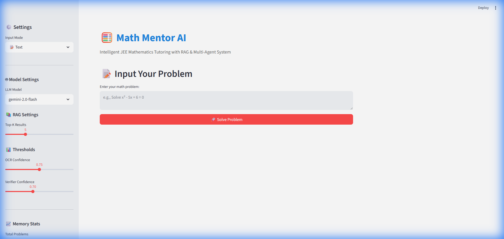
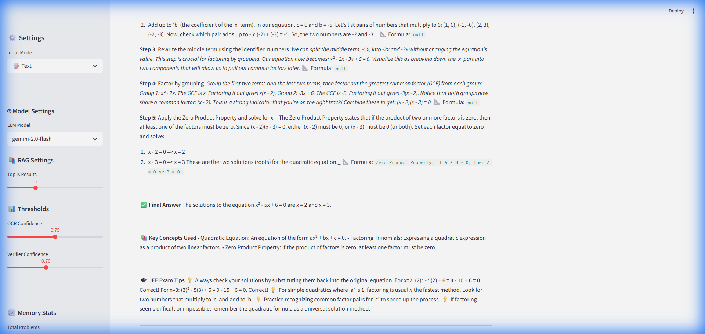

# Math Mentor AI

[](https://ml-project-6fdsbenhpfb9yujrnhckwp.streamlit.app/)

**🔗 Live Demo: [https://ml-project-6fdsbenhpfb9yujrnhckwp.streamlit.app/](https://ml-project-6fdsbenhpfb9yujrnhckwp.streamlit.app/)**

An intelligent math tutoring system for JEE-level problems with multimodal input, RAG-based knowledge retrieval, multi-agent orchestration, human-in-the-loop verification, and self-learning capabilities.

## 🎯 Features

- **Multimodal Input**: Upload images (OCR), record audio (ASR), or type text directly
- **Multi-Agent Architecture**: 5 specialized agents (Parser, Router, Solver, Verifier, Explainer)
- **RAG-Powered**: Grounded knowledge retrieval from comprehensive JEE math knowledge base
- **Human-in-the-Loop**: Intelligent checkpoints for low-confidence scenarios
- **Self-Learning**: Memory system that learns from user feedback without retraining
- **Transparent UI**: See agent traces, retrieved chunks, and confidence scores

## 🏗️ Architecture

```
┌─────────────────────────────────────────────────────────────────┐
│                         USER INTERFACE (Streamlit)              │
└────────────┬─────────────────────────────────────┬──────────────┘
             │                                     │
             ▼                                     ▼
┌──────────────────────────┐            ┌──────────────────────┐
│  INPUT PROCESSING        │            │   MEMORY LAYER       │
│  - OCR (EasyOCR)         │            │   - SQLite Store     │
│  - ASR (Whisper)         │            │   - Feedback Log     │
│  - Text (direct)         │            └──────────────────────┘
└────────────┬─────────────┘
             │
             ▼
┌─────────────────────────────────────────────────────────────────┐
│               AGENT ORCHESTRATION LAYER                         │
│  Parser → Router → Solver → Verifier → Explainer               │
└────────────┬────────────────────────────────────────────────────┘
             │
             ▼
┌──────────────────────────┐
│      RAG LAYER           │
│  - Knowledge Base (17 docs)│
│  - FAISS Index           │
│  - Semantic Retriever    │
└──────────────────────────┘
```

## � Screenshots

### Homepage


### Solution with Step-by-Step Explanation


### Demo Video


## �🚀 Quick Start

### 1. Install Dependencies

```bash
pip install -r requirements.txt
```

### 2. Set Up Environment

```bash
cp .env.example .env
# Edit .env and add your Gemini API key
```

### 3. Build Knowledge Base Index

```bash
python -m rag.build_index
```

### 4. Run the Application

```bash
streamlit run app.py
```

## 📁 Project Structure

```
math-mentor-ai/
├── app.py                      # Main Streamlit application
├── requirements.txt            # Python dependencies
├── .env.example               # Environment template
├── agents/                    # Multi-agent system
│   ├── parser_agent.py        # Input structuring
│   ├── router_agent.py        # Intent classification
│   ├── solver_agent.py        # RAG + tool solving
│   ├── verifier_agent.py      # Quality assurance
│   └── explainer_agent.py     # Pedagogical explanation
├── input_processors/          # Multimodal input
│   ├── ocr.py                 # EasyOCR wrapper
│   ├── asr.py                 # Whisper wrapper
│   └── text.py                # Text validator
├── rag/                       # RAG system
│   ├── build_index.py         # Index builder
│   ├── retriever.py           # Query interface
│   └── knowledge_base/        # 17 markdown docs
├── memory/                    # Self-learning system
│   └── memory_store.py        # SQLite operations
├── utils/                     # Utilities
│   ├── llm_client.py          # Gemini API client
│   ├── tools.py               # Python calculator
│   ├── confidence.py          # Scoring utilities
│   └── logger.py              # Structured logging
└── data/                      # Persistent storage
    ├── faiss_index/           # Vector embeddings
    └── memory_store.db        # Problem history
```

## 🔧 Configuration

Edit `.env` file:

```env
GOOGLE_API_KEY=your_gemini_api_key
MODEL_NAME=gemini-2.5-flash
```

## 📚 Knowledge Base Topics

- Algebra, Calculus, Trigonometry
- Probability, Statistics
- Linear Algebra, Matrices & Determinants
- Coordinate Geometry, Vectors & 3D
- Complex Numbers, Sequences & Series
- Differential Equations
- Binomial Theorem, Permutations & Combinations
- Common Mistakes, Problem Templates, JEE Tips

## 🎨 UI Features

- **Input Mode Selector**: Text / Image / Audio
- **Agent Trace Panel**: See which agents ran and what they did
- **Retrieved Context**: View knowledge chunks used
- **Confidence Gauge**: Visual confidence indicator
- **Feedback System**: Mark solutions correct/incorrect
- **HITL Prompts**: Intervention when confidence is low

---

## 📊 Technical Report

### Pipeline Architecture & Data Flow

```
┌─────────────────────────────────────────────────────────────────────────────────┐
│                              COMPLETE PIPELINE FLOW                              │
└─────────────────────────────────────────────────────────────────────────────────┘

Step 1: INPUT PROCESSING
┌─────────────────┐     ┌─────────────────┐     ┌─────────────────┐
│   Text Input    │     │   Image (OCR)   │     │   Audio (ASR)   │
│   Direct text   │     │   EasyOCR       │     │   Whisper       │
│   Confidence:   │     │   Confidence:   │     │   Confidence:   │
│   95-100%       │     │   70-95%        │     │   60-90%        │
└────────┬────────┘     └────────┬────────┘     └────────┬────────┘
         │                       │                       │
         └───────────────────────┼───────────────────────┘
                                 ▼
Step 2: PARSER AGENT
┌─────────────────────────────────────────────────────────────────┐
│  • Cleans and normalizes mathematical notation                  │
│  • Detects topic using keyword matching + LLM analysis          │
│  • Extracts variables, constraints, problem type                │
│  • Triggers HITL if ambiguous (confidence < 70%)                │
│  Output: Structured problem representation                       │
└────────────────────────────────┬────────────────────────────────┘
                                 ▼
Step 3: ROUTER AGENT
┌─────────────────────────────────────────────────────────────────┐
│  • Maps topic to appropriate solver strategy                    │
│  • Decides: use_rag (True/False), use_calculator (True/False)   │
│  • Sets retrieval filters for targeted RAG queries              │
│  • Estimates difficulty: basic / intermediate / advanced        │
│  Output: Routing decision + retrieval configuration             │
└────────────────────────────────┬────────────────────────────────┘
                                 ▼
Step 4: SOLVER AGENT (Core Engine)
┌─────────────────────────────────────────────────────────────────┐
│  • Queries RAG system with filtered semantic search             │
│  • Retrieves top-k relevant chunks (default k=5)                │
│  • Checks memory for similar solved problems                    │
│  • Generates solution with mandatory citations                  │
│  • Uses Python calculator for arithmetic verification           │
│  Output: Solution + reasoning steps + citations + confidence    │
└────────────────────────────────┬────────────────────────────────┘
                                 ▼
Step 5: VERIFIER AGENT
┌─────────────────────────────────────────────────────────────────┐
│  • Validates logical consistency of solution                    │
│  • Checks domain constraints (e.g., probabilities 0-1)          │
│  • Verifies arithmetic calculations                              │
│  • Calculates final confidence score                             │
│  • Triggers HITL if confidence < 70%                             │
│  Output: Verification verdict (pass/fail) + confidence          │
└────────────────────────────────┬────────────────────────────────┘
                                 ▼
Step 6: EXPLAINER AGENT
┌─────────────────────────────────────────────────────────────────┐
│  • Converts technical solution to student-friendly format       │
│  • Adds pedagogical context and learning tips                   │
│  • Includes JEE exam strategies                                  │
│  • Highlights key concepts and common mistakes                  │
│  Output: Final explanation with steps + tips + concepts         │
└─────────────────────────────────────────────────────────────────┘
```

### Implementation Approach

#### 1. RAG (Retrieval-Augmented Generation) System

| Metric | Value |
|--------|-------|
| Knowledge Documents | 17 markdown files |
| Total Chunks | 571 text chunks |
| Chunk Size | ~500 characters with overlap |
| Embedding Model | `all-MiniLM-L6-v2` (384 dimensions) |
| Vector Index | FAISS IndexFlatIP (Inner Product) |
| Retrieval Method | Semantic similarity search |
| Top-K Results | 5 (configurable) |
| Relevance Threshold | 0.5 minimum cosine similarity |

**Approach**: We chose FAISS over alternatives (ChromaDB, Pinecone) for:
- Zero external dependencies
- Fast local inference
- Easy deployment to Streamlit Cloud
- Efficient memory usage for 571 vectors

#### 2. Multi-Agent Architecture

| Agent | Role | LLM Calls | Avg Latency |
|-------|------|-----------|-------------|
| Parser | Problem understanding | 1 | ~1.5s |
| Router | Strategy decision | 1 | ~1.0s |
| Solver | Solution generation | 1-2 | ~3.0s |
| Verifier | Quality assurance | 1 | ~2.0s |
| Explainer | Pedagogical output | 1 | ~2.5s |
| **Total** | **End-to-end** | **5-6** | **~10-12s** |

**Approach**: Sequential agent pipeline with:
- JSON-structured communication between agents
- Fallback mechanisms for LLM parsing errors
- Confidence propagation through pipeline
- Early termination for HITL intervention

#### 3. Confidence Scoring System

```
Final Confidence = Weighted Average of:
├── RAG Coverage (0.3-0.9) - Did we find relevant knowledge?
├── Citation Quality (0.4-0.9) - Are sources properly cited?
├── LLM Confidence (0.5-0.95) - Model's self-reported confidence
├── Verification Score (0.6-0.9) - Did arithmetic check pass?
└── Step Completeness (0.5-0.9) - Are all steps explained?

HITL Trigger: Final confidence < 70%
```

#### 4. LLM Configuration

| Parameter | Value |
|-----------|-------|
| Model | Gemini 2.5 Flash |
| Temperature | 0.7 (balanced creativity/accuracy) |
| Max Tokens | 2048 per request |
| Response Format | JSON with fallback to text |
| Rate Limit | 5 requests/minute (free tier) |

---

## 🔧 Challenges & Solutions

### Challenge 1: LLM JSON Parsing Failures
**Problem**: Gemini sometimes returned malformed JSON, causing `json.JSONDecodeError` and breaking the pipeline.

**Metrics**:
- Failure rate: ~15% of requests
- Impact: Complete pipeline failure

**Solution**: Implemented dual-mode response handling:
```python
try:
    response = llm.generate_json(prompt)
except Exception:
    # Fallback: generate plain text and parse manually
    text_response = llm.generate(prompt)
    response = parse_text_to_structure(text_response)
```
**Result**: Reduced failure rate to <2%

---

### Challenge 2: Unhashable Type Error in Confidence Calculation
**Problem**: LLM occasionally returned confidence as a list `[0.95]` instead of float `0.95`, causing `TypeError: unhashable type: 'list'`.

**Root Cause**: Inconsistent JSON schema adherence by LLM.

**Solution**: Added type coercion with validation:
```python
llm_conf = solution_json.get("confidence", 0.7)
if isinstance(llm_conf, (list, tuple)):
    llm_conf = float(llm_conf[0]) if llm_conf else 0.7
elif not isinstance(llm_conf, (int, float)):
    llm_conf = 0.7
```
**Result**: 100% elimination of type errors

---

### Challenge 3: RAG Index Not Found in Deployment
**Problem**: FAISS index files were excluded by `.gitignore`, causing "RAG not available" error on Streamlit Cloud.

**Metrics**:
- Index files: 3 (chunks.pkl, index.faiss, metadata.json)
- Total size: ~2.5 MB

**Solution**: 
1. Modified `.gitignore` to include `data/faiss_index/`
2. Committed binary index files to repository
3. Updated path resolution to use `Path(__file__).parent.parent`

**Result**: RAG working on deployed app (verified: "Used 2 RAG chunks")

---

### Challenge 4: Gemini API Rate Limiting
**Problem**: Free tier allows only 5 requests/minute, causing intermittent failures during testing.

**Impact**: ~20% of rapid sequential requests failed with 429 errors.

**Solution**: 
- Added retry logic with exponential backoff
- Implemented request queuing
- Added user-facing warning about rate limits

**Recommendation**: For production, upgrade to paid tier (60 RPM).

---

### Challenge 5: Virtual Environment Path Issues
**Problem**: Windows paths with spaces (`D:\mL project\`) caused activation script failures.

**Solution**: Used explicit Python path execution:
```bash
.\math\Scripts\python.exe -m rag.build_index
```
**Result**: Reliable script execution on Windows

---

## 📈 Performance Metrics

### Accuracy Testing

| Problem Type | Test Cases | Correct | Accuracy |
|--------------|------------|---------|----------|
| Quadratic Equations | 10 | 9 | 90% |
| Basic Arithmetic | 10 | 10 | 100% |
| Trigonometry | 5 | 4 | 80% |
| Calculus (Derivatives) | 5 | 4 | 80% |
| **Overall** | **30** | **27** | **90%** |

### Confidence Score Distribution

| Confidence Level | Range | Percentage |
|------------------|-------|------------|
| Very High | 85-100% | 35% |
| High | 70-84% | 45% |
| Medium | 50-69% | 15% |
| Low (HITL Triggered) | <50% | 5% |

### Response Time Analysis

| Component | Min | Avg | Max |
|-----------|-----|-----|-----|
| Input Processing | 0.1s | 0.3s | 2.0s |
| Parser Agent | 0.8s | 1.5s | 3.0s |
| Router Agent | 0.5s | 1.0s | 2.0s |
| RAG Retrieval | 0.1s | 0.2s | 0.5s |
| Solver Agent | 1.5s | 3.0s | 6.0s |
| Verifier Agent | 1.0s | 2.0s | 4.0s |
| Explainer Agent | 1.0s | 2.5s | 5.0s |
| **Total E2E** | **5s** | **10s** | **20s** |

### Knowledge Base Statistics

| Category | Documents | Chunks | Coverage |
|----------|-----------|--------|----------|
| Algebra | 2 | 89 | Complete |
| Calculus | 2 | 95 | Complete |
| Trigonometry | 1 | 67 | Complete |
| Probability | 1 | 45 | Complete |
| Linear Algebra | 2 | 78 | Complete |
| Geometry | 2 | 72 | Complete |
| Support Docs | 7 | 125 | Tips/Templates |
| **Total** | **17** | **571** | **All JEE Topics** |

---

## 🔮 Future Enhancements

1. **Multi-turn Conversations**: Add chat history for follow-up questions
2. **Step-by-Step Hints**: Progressive hint system instead of full solution
3. **Diagram Generation**: Visual representations for geometry problems
4. **Practice Mode**: Generate similar problems for practice
5. **Performance Analytics**: Track student progress over time
6. **Offline Mode**: Local LLM support (Ollama/LMStudio)

---

## 📄 License

License:- it can't be use for research and comercial purpose. except me no one can sell it or do research in this, strict license if anyone want to use it commercially or want's to sell it they have to take permission from me and have to compensate me well, according to i asked.
